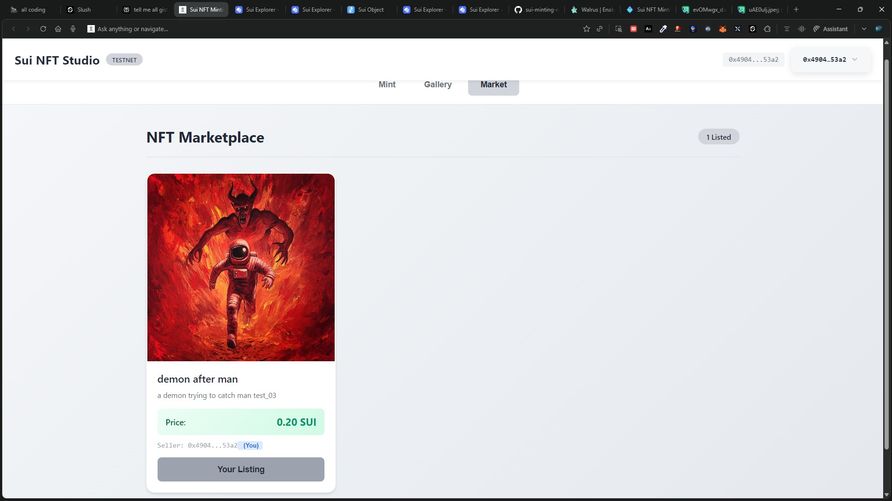

# Sui NFT Minting dApp

A decentralized application for minting, managing, trading, and staking NFTs on Sui blockchain with Move smart contracts and React frontend.

## Screenshots

### NFT Minting Interface


### NFT Collection Gallery


### NFT Marketplace



## Features

### Core Features

- Connect Sui Wallet
- Mint NFTs with name, description, and image URL
- Transfer NFTs to other addresses
- View transactions on Sui Explorer

### Advanced Features

- **NFT Gallery** - View your entire NFT collection with images
- **Transfer UI** - Send NFTs to any address with one click
- **NFT Marketplace** - List NFTs for sale and buy from others
- **NFT Staking** - Stake NFTs to earn rewards over time
- **Dynamic Fields** - Add attributes to NFTs after minting
- **Batch Minting** - Mint multiple NFTs in one transaction
- **Image Preview** - See your NFT image before minting
- **Modern UI** - Tabbed interface with warm, branded design

## Quick Start

### 1. Deploy Contracts

```bash
cd move/mint_nft
sui move build
sui client publish --gas-budget 100000000
```

From the deployment output, note the following:

- **Package ID** - Found in the "Published Objects" section
- **Marketplace ID** - The shared object of type `Marketplace`
- **Staking Pool ID** - The shared object of type `StakingPool`

See [DEPLOYMENT.md](./DEPLOYMENT.md) for detailed instructions on finding these IDs.

### 2. Configure Frontend

Update the configuration file `app/src/config.js` with your deployed contract IDs:

```javascript
export const CONFIG = {
  NETWORK: "testnet",

  // Contract addresses - Update after deployment
  PACKAGE_ID: "YOUR_PACKAGE_ID",
  MARKETPLACE_ID: "YOUR_MARKETPLACE_ID",
  STAKING_POOL_ID: "YOUR_STAKING_POOL_ID",

  // Other settings...
};
```

### 3. Run App

```bash
cd app
npm install --legacy-peer-deps
npm start
```

Opens at http://localhost:3000

## Instructions

- Upload images to Imgur, IPFS, or any public image hosting service
- Get testnet SUI tokens: `sui client faucet`
- Ensure your wallet is connected to Sui Testnet

## Project Structure

```
sui-project/
├── move/mint_nft/
│   ├── sources/
│   │   ├── mint_nft.move      # Core NFT + Dynamic Fields
│   │   ├── marketplace.move   # NFT Marketplace
│   │   └── staking.move       # NFT Staking Pool
│   ├── tests/
│   │   └── mint_nft_tests.move
│   └── Move.toml
├── app/src/
│   ├── config.js              # Centralized configuration
│   ├── components/
│   │   ├── MintNFT.js         # Minting with preview
│   │   ├── NFTGallery.js      # Collection view
│   │   ├── Marketplace.js     # Buy/Sell NFTs
│   │   └── Staking.js         # Stake NFTs for rewards
│   ├── App.js                 # Tab navigation
│   └── index.js
├── README.md
└── DEPLOYMENT.md
```

## Smart Contract Functions

### mint_nft Module

| Function                                | Description                  |
| --------------------------------------- | ---------------------------- |
| `mint_nft(name, description, uri)`      | Mints NFT to caller          |
| `transfer_nft(nft, recipient)`          | Transfers NFT to address     |
| `add_attribute(nft, key, value)`        | Adds dynamic field attribute |
| `update_attribute(nft, key, new_value)` | Updates existing attribute   |
| `remove_attribute(nft, key)`            | Removes an attribute         |
| `batch_mint(names, descriptions, uris)` | Mints multiple NFTs          |

### marketplace Module

| Function                                       | Description           |
| ---------------------------------------------- | --------------------- |
| `list_nft(marketplace, nft, price)`            | Lists NFT for sale    |
| `buy_nft(marketplace, escrow, payment)`        | Purchases listed NFT  |
| `delist_nft(marketplace, escrow)`              | Cancels listing       |
| `update_price(marketplace, nft_id, new_price)` | Updates listing price |

### staking Module

| Function                                 | Description                     |
| ---------------------------------------- | ------------------------------- |
| `stake_nft(pool, nft, clock)`            | Stakes NFT to earn rewards      |
| `unstake_nft(pool, stake_record, clock)` | Unstakes NFT and claims rewards |

## Architecture

### Shared Objects

The marketplace and staking pool use shared objects, allowing multiple users to interact simultaneously:

```move
transfer::share_object(marketplace);
transfer::share_object(staking_pool);
```

### Dynamic Fields

Add metadata to NFTs after creation:

```move
use sui::dynamic_field as df;
df::add(&mut nft.id, key, value);
```

### Escrow Pattern

NFTs are held in escrow while listed, ensuring safe marketplace trades:

```move
public struct Escrow has key {
    id: UID,
    nft: NFT,
    listing_id: ID,
}
```

### Staking Mechanism

NFTs are wrapped in StakeRecord objects that track staking duration:

```move
public struct StakeRecord has key {
    id: UID,
    nft: NFT,
    stake_time_ms: u64,
    owner: address,
}
```

Note: The staking rewards shown are for demonstration purposes on testnet.

## Tech Stack

- **Blockchain:** Sui (Testnet)
- **Smart Contracts:** Move (2024.beta edition)
- **Frontend:** React 18
- **SDK:** @mysten/dapp-kit, @mysten/sui
- **Styling:** CSS3 with modern design

## Troubleshooting

### Common Issues

1. **Wallet not connecting**: Ensure Sui Wallet extension is installed and set to Testnet
2. **Transaction fails**: Check you have sufficient SUI for gas (`sui client faucet`)
3. **NFT images not loading**: Verify the image URL is publicly accessible (use Imgur, IPFS)
4. **Marketplace shows 0 listed**: Ensure MARKETPLACE_ID is correctly configured in config.js

### Getting Test SUI

```bash
sui client faucet
```

This will request testnet SUI tokens to your active address.

## Resources

- [Sui Documentation](https://docs.sui.io/)
- [Move Language Guide](https://move-language.github.io/move/)
- [Sui Explorer (Testnet)](https://suiscan.xyz/testnet)
- [Dynamic Fields Guide](https://docs.sui.io/concepts/dynamic-fields)

---

**Project** by [Anand Vashishtha](https://github.com/Anand-0037)
